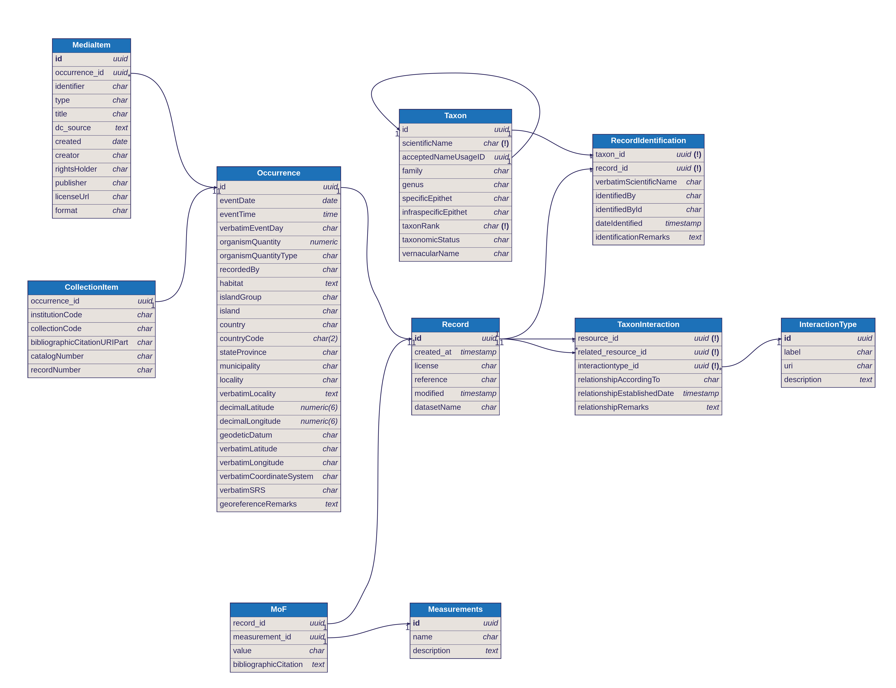

# XicotliData: Integration of biodiversity data of wild bee-plant interactions in Mexico
## Database schemas

This project aims to mobilize and integrate information about the interactions 
between Mexican wild bees and host plants (wild and cultivated).

Database schemas to store biological interactions are available on this 
repository. These schemas can be found on the `schemas` folder. All schemas are
written on [DBML - Database Markup Language](https://www.dbml.org/).

## XicotliData schema

The main schema used for the project data is 
[XicotliData.dbml](schemas/XicotliData.dbml). The schema was designed to include
data from Naturalista and biological collections. It also possible to capture
taxon related information.

## Authors

- Juan M. Barrios - juan.barrios@conabio.gob.mx
- Brenda Y. Bedolla-Garcia
- Carlos A. Cultid-Medina
- Paola A. González
- Andrés Lira
- Juan C. López
- Daniel Madrigal
- Jorge Mérida
- Ramón Rivera
- Pilar Rodríguez
- Matthias Rös
- Raúl Sierra-Alcocer - rsierra@conabio.gob.mx
- Remy Vandame
